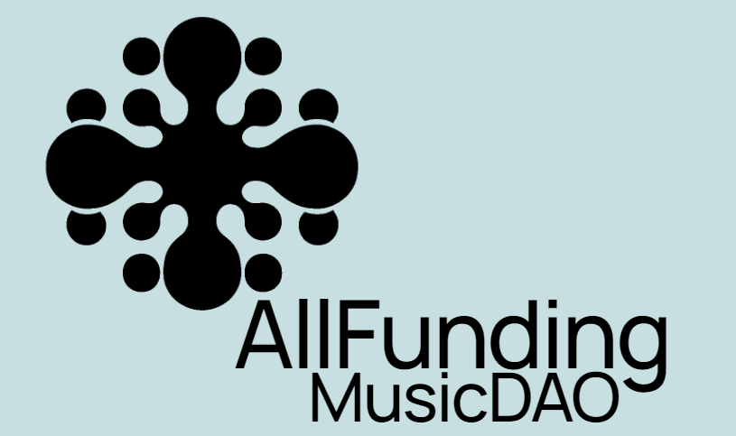

<!-- # ALLFUNDING -->

## Introduction:

Allfunding is a crowdfunding solution for artists looking for financing for their project.
Anyone can participate financially in the project by depositing funds into a liquidity pool.
By depositing their funds, the investor receives a proof of contribution by NFT.
The artist submits to a vote the different steps of his project which requests financing, the contributors approve and the artist can use his funds to make the dream he has nourished come true.

## Team:

Igor BOURNAZEL - Développeur
Yoann RADENAC - Développeur
Arnaud SENE - Développeur
Ruddy CHAM - Consultant

## Hackathon links:

- presentation: https://pitch.com/v/allfunding-hackathon-4cfvcq
- logo : ipfs:/QmPGtK2BLf3o3tpKWvqiehCGqiSPqRjdp4Rp6XQJ9iqg2n/
- front repository: https://github.com/AlyraButerin/allfeat-funding-front
- back repository: https://github.com/AlyraButerin/allfeat-funding
- last deployment addresses (Harmony testnet) at block 507009:
  - GovToken: 0x461c43E1e49B0c72EECB01d0A2ebcAfFc70D422B
  - ArtistVault: 0xe970F1b6Be86382c1D41ECE43F84f4563aCe2835
  - ProjectDao: 0xdFbf6Daa7D37CA6E9bCCCf622833921eCDf23bAE

## Stack:

Blockchain:

- solidity / Foundry
- testnet Harmony

Front:

- Next.js
- wagmi
- raimbow kit
